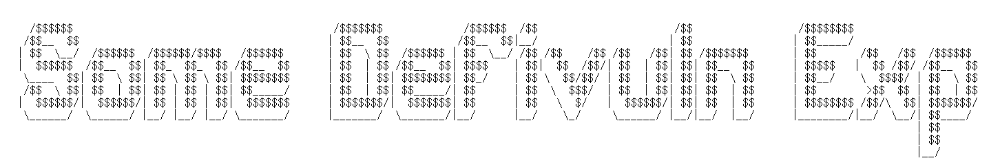

## **ULME**

### 漏洞原因

ULME Token::buyMiner() public 函数, 可恶意用授权 USDT 的地址, 去兑换 ULME 代币.

攻击步骤: 

(1)闪电贷借入 USDT

(2) USDT 兑换成 ULME

(3) 调用 ULME Token contract::buyMiner(), 传入事先收集的授权 USDT 给 ULME Token 合约的地址购买 ULME 拉高币价

(4) 出售 ULME 获利

```SOLIDITY
    function buyMiner(address user,uint256 usdt)public returns (bool){
        address[]memory token=new address[](2);
        token[0]=_usdt_token;
        token[1]=address(this);
        usdt=usdt.add(usdt.div(10));
        require(IERC20(_usdt_token).transferFrom(user,address(this),usdt), "buyUlm: transferFrom to ulm error");
        uint256 time=sale_date;
        sale_date=0;
        address k=0x25812c28CBC971F7079879a62AaCBC93936784A2;
        IUniswapV2Router01(_roter).swapExactTokensForTokens(usdt,1000000,token,k,block.timestamp+60);
        IUniswapV2Router01(k).transfer(address(this),address(this),IERC20(address(this)).balanceOf(k));
        sale_date=time;
        return true;
    }
}
```

### POC复现漏洞

[ULME-exp.sol](https://github.com/Poor4ever/Some-defivuln-exp/blob/main/src/ULME-exp.sol)

```
forge test --contracts "./src/ULME-exp.sol" -vvv
```

攻击获利: ~ 30,437 OHM

attack_tx:
https://etherscan.io/tx/0xdb9a13bc970b97824e082782e838bdff0b76b30d268f1d66aac507f1d43ff4ed

相关链接: 
<br>
https://twitter.com/blocksecteam/status/1584839309781135361
<br>
https://twitter.com/BeosinAlert/status/1584888021299916801


## OlympusDAO

### 漏洞原因

 BondFixedExpiryTeller::redeem() 函数对传入的 token_ 没有校验, 传入攻击者自己部署的地址, 函数内的 expiry()/burn() 函数都走攻击者恶意构造的逻辑保证正常执行，而 underlying() 返回 OHM 地址进行 transfer().

```SOLIDITY
    function redeem(ERC20BondToken token_, uint256 amount_) external override nonReentrant {
        if (uint48(block.timestamp) < token_.expiry())
            revert Teller_TokenNotMatured(token_.expiry());
        token_.burn(msg.sender, amount_);
        token_.underlying().transfer(msg.sender, amount_);
    }
```

### POC复现漏洞

[OlympusDAO-exp.sol](https://github.com/Poor4ever/Some-defivuln-exp/blob/main/src/OlympusDAO-exp.sol)

```
forge test --contracts "./src/OlympusDAO-exp.sol" -vvv
```

攻击获利: ~ 30,437 OHM

attack_tx:
https://etherscan.io/tx/0x3ed75df83d907412af874b7998d911fdf990704da87c2b1a8cf95ca5d21504cf

相关链接: 
<br>
https://twitter.com/Supremacy_CA/status/158342502609464115
<br>
https://twitter.com/peckshield/status/1583416829237526528

## HEALTH

### 漏洞原因

每次 transfer() 转账都会燃烧池子里 0.1% 的 HEALTH Token,多次调用 transfer() 消耗池子里的 HEALTH Token,最后再交换消耗前闪电贷借入WBNB 换的 HEALTH Token,售出为 WBNB 获利.

```SOLIDITY
    function _transfer(address from, address to, uint256 value) private {
        //..
        uint256 burnValue = _balances[uniswapV2Pair].mul(burnFee).div(1000);
        _balances[uniswapV2Pair] = _balances[uniswapV2Pair].sub(burnValue);
        _balances[_burnAddress] = _balances[_burnAddress].add(burnValue);
        //..
    }
```

### POC复现漏洞

[HEALTH-exp.sol](https://github.com/Poor4ever/Some-defivuln-exp/blob/main/src/HEALTH-exp.sol)

```
forge test --contracts "./src/HEALTH-exp.sol" -vvv
```

攻击获利: ~ 16 WBNB

attack_tx: https://bscscan.com/tx/0xae8ca9dc8258ae32899fe641985739c3fa53ab1f603973ac74b424e165c66ccf

相关链接: 
<br>

https://twitter.com/BlockSecTeam/status/1583073442433495040

## Temple DAO

### 漏洞原因

StaxLPStaking 合约 migrateStake() 函数 (1)没有访问控制,任意 EOA 账户或合约可以随意调用,(2) 函数 oldStaking 可以任意传参,传入自己恶意部署的合约地址,凭空获得 LP Token. 

```SOLIDITY
    function migrateStake(address oldStaking, uint256 amount) external {
        StaxLPStaking(oldStaking).migrateWithdraw(msg.sender, amount);
        _applyStake(msg.sender, amount);
    }
```

### POC复现漏洞

[templedao-exp.sol](https://github.com/Poor4ever/Some-defivuln-exp/blob/main/src/templedao-exp.sol)

```
forge test --contracts "./src/templedao-exp.sol -vvv
```

攻击获利: ~ 2 M USDC

attack_tx: https://etherscan.io/tx/0x8c3f442fc6d640a6ff3ea0b12be64f1d4609ea94edd2966f42c01cd9bdcf04b5

Remove liquidity and sale_tx: https://etherscan.io/tx/0x4b119a4f4ba1ad483e9851973719f310527b43f3fcc827b6d52db9f4c1ddb6a2


## Arbitrage contract

### 漏洞原因

套利合约闪电贷回调函数 `pancakeCall` 没有限制仅 Pair 合约可调用.

### POC 复现漏洞

[arbitrage_contract-exp.sol](https://github.com/Poor4ever/Some-Defivlun-Exp/blob/main/src/arbitrage_contract-exp.sol) 

```
forge test --contracts "./src/arbitrage_contract-exp.sol" -vvv
```

攻击获利: ~ 25912 USDT / ~ 327 WBNB / ~ 5160 BUSD / ~ 0.014 BTCB / ~ 0.097 ETH

attack_tx: https://bscscan.com/tx/0xd48758ef48d113b78a09f7b8c7cd663ad79e9965852e872fdfc92234c3e598d2


## ShadowFi

### 漏洞原因

`burn()` 函数允许任何人调用燃烧任意地址的代币,导致 LP Pair 合约 $SDT代币被恶意消耗完,用小部分 $SDT 代币就可以掏空池子里的 WBNB.

```solidity
    function burn(address account, uint256 _amount) public {
        _transferFrom(account, DEAD, _amount);

        emit burnTokens(account, _amount);
    }
```

### POC 复现漏洞

[shadowfi-exp.sol](https://github.com/Poor4ever/Some-Defivlun-Exp/blob/main/src/shadowfi-exp.sol) 

```
forge test --contracts "./src/shadowfi.sol" -vvv
```

攻击获利: ~ 1078 WBNB

attack_tx:https://bscscan.com/tx/0xe30dc75253eecec3377e03c532aa41bae1c26909bc8618f21fb83d4330a01018 


## luckytiger

### 漏洞原因

糟糕的随机源取自链上, 遇到不想要的结果让交易回滚

```solidity
    function publicMint() public payable {
        uint256 supply = totalSupply();
        require(!pauseMint, "Pause mint");
        require(msg.value >= price, "Ether sent is not correct");
        require(supply + 1 <= maxTotal, "Exceeds maximum supply");
        _safeMint(msg.sender, 1);
        bool randLucky = _getRandom();
        uint256 tokenId = _totalMinted();
        emit NEWLucky(tokenId, randLucky);
        tokenId_luckys[tokenId] = lucky;
        if(tokenId_luckys[tokenId] == true){
        require(payable(msg.sender).send((price * 190) / 100));
        require(payable(withdrawAddress).send((price * 10) / 100));}
    }
    
    function _getRandom() private returns(bool) {
        uint256 random = uint256(keccak256(abi.encodePacked(block.difficulty, block.timestamp)));
        uint256 rand = random%2;
        if(rand == 0){return lucky = false;}
        else         {return lucky = true;}
    }
```

### POC 复现漏洞

[luckytiger-exp.sol](https://github.com/Poor4ever/Some-Defivlun-Exp/blob/main/src/luckytiger-exp.sol) 

```
forge test --contracts "./src/luckytiger-exp.sol.sol" -vvv
```

攻击获利: 忽略不计

attack_tx:
https://etherscan.io/tx/0x804ff3801542bff435a5d733f4d8a93a535d73d0de0f843fd979756a7eab26af


## QIXI

### 漏洞原因

Solidity 0.8 版本以下没有溢出检测，从 QIXI -BNB LP 池子闪电贷借空池子里 BNB,QIXI Token 存在溢出, _Transfer 没有对转账的发送钱包余额检查,任意调用转账时在 _basicTransfer 里下溢获得大量 QIXI Token,闪电贷回调里转 QIXI Token 到 LP 池子,满足 K 值检查,不用偿还 BNB.

```solidity
     function _basicTransfer(address sender, address recipient, uint256 value) internal returns (bool) {
        balanceOf[sender] -= value;
        balanceOf[recipient] += value;
        emit Transfer(sender, recipient, value);
        return true;
    }
```

### POC 复现漏洞

[QIXI-exp.sol](https://github.com/Poor4ever/Some-Defivlun-Exp/blob/main/src/QIXI-exp.sol) 

```
forge test --contracts "./src/QIXI-exp.sol" -vvv
```

攻击获利: ~ 6 WBNB

attack_tx: https://bscscan.com/tx/0x16be4fe1c8fcab578fcb999cbc40885ba0d4ba9f3782a67bd215fb56dc579062

